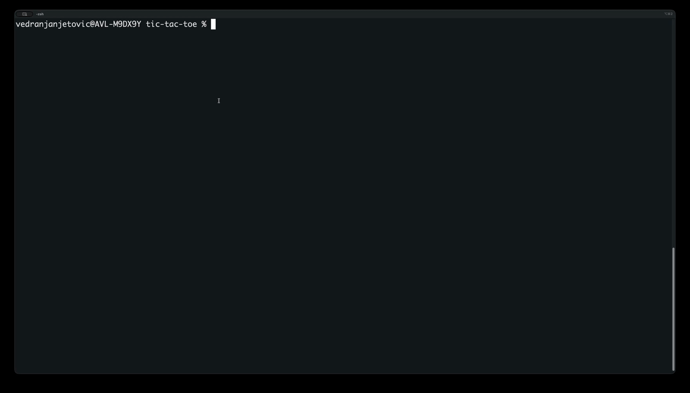

# gg

[](https://github.com/VedranJanjetovic/gg/releases)

Claude and Codex are brilliant — and utterly unsupervised. gg is the adult in the room: a deterministic, QA-gated pipeline that runs your task through planning, development, testing, and review as isolated phases, each with the agent, model, and effort level *you* chose. Repeatable steps stop re-deriving themselves from scratch on every run, so your tokens go into code instead of déjà vu. Detach, grab a coffee, come back to a reviewed branch.



## Install

### Linux and macOS

```bash
curl -fsSL --proto '=https' --tlsv1.2 https://raw.githubusercontent.com/VedranJanjetovic/gg/main/install.sh | bash
```

To pin a release, pass the version through to the script (without the `gg-v`
tag prefix):

```bash
curl -fsSL --proto '=https' --tlsv1.2 https://raw.githubusercontent.com/VedranJanjetovic/gg/main/install.sh | bash -s -- --version 1.2.3
```

### Windows PowerShell

```powershell
$url = 'https://raw.githubusercontent.com/VedranJanjetovic/gg/main/install.ps1'
Invoke-WebRequest -Uri $url -OutFile .\install.ps1
Set-ExecutionPolicy -Scope Process -ExecutionPolicy Bypass
.\install.ps1
Remove-Item .\install.ps1
```

For inspected, non-pipe installation, prefixes, supported platforms, security
notes, and troubleshooting, see [the full installation guide](docs/install.md).

## Quick start

1. Configure your defaults from the project directory:

   ```bash
   gg configure
   ```

2. Start a workflow. With no project selector, `gg run` asks for the project
   description and creates the project:

   ```bash
   gg run
   ```

3. From the global selector opened by bare `gg`, use `↑`/`↓` or `j`/`k` to
   choose a project, then press `Enter` to attach — or type its listed number
   when that number is `1`–`9`. `q` or Ctrl-C leaves the selector and exits gg.
   You can also attach directly with `gg <project>`.

4. In the attached view, `q`, `b`, or Ctrl-C detaches and returns to the
   selector. The pipeline continues in the background; reattach later with
   `gg <project>`.

The attached view shows phase progress, QA feedback, and agent-reported usage.
See [how the pipeline runs](docs/pipeline.md) for lifecycle, artifacts, and
recovery details.

## Commands

| Command | Description |
| --- | --- |
| `gg configure` | Open the interactive configuration workflow. |
| `gg list [-a]` | List gg projects. `-a`/`--all` also includes finished and terminated projects. |
| `gg status [project]` | Show one project's detail, or a status table for every project. |
| `gg usage` | Show token and USD usage per project. |
| `gg run [flags] [project] [-- args]` | Start a gg workflow. See [run-only overrides](#configuration). |
| `gg resume [--repair-existing-verification] [project]` | Resume a stopped or failed gg workflow from its persisted snapshot. |
| `gg stop <project>` | Stop a running gg workflow. |
| `gg stop-all` | Stop every persisted running gg workflow. |
| `gg prune [--yes]` | Remove done (finished/terminated) projects. `--yes` skips the confirmation prompt. |
| `gg remove [--yes] <project>` | Remove one project of any parked status. `--yes` skips the confirmation prompt. |
| `gg update` | Update gg components. |
| `gg version` | Show gg build version. |

Bare `gg` opens the global project selector and project-creation flow; `gg
<project>` attaches to an existing project. `gg --configure` and `gg --version`
are aliases for `gg configure` and `gg version`. `gg --help` lists the commands
and `gg <command> --help` documents one command's arguments.

## Configuration

Project configuration is layered over built-in and global defaults. A compact
project YAML example:

```yaml
version: 2
defaults:
  agent: claude
  model: claude-sonnet-5
  effort: medium
  provenance: catalog
phases:
  - phase: acceptance_criteria
    enabled: true
    required: true
    settings: {agent: claude, model: claude-sonnet-5, effort: high, provenance: catalog}
  # ...one complete settings tuple per canonical phase...
gitops:
  parent_branch: main
  base_ref: HEAD
  enable_pr: true
  enable_ci: true
```

Every phase entry carries a complete settings tuple, and `provenance` records
whether the model came from the catalog (validated against its agent) or was
typed manually (not validated). A complete file lists all ten canonical phases
in execution order.

For one run only, `gg run` accepts these operational overrides:

- GitOps: `--parent-branch branch`, `--base-ref ref`, `--enable-pr`,
  `--disable-pr`, `--enable-ci`, `--disable-ci`.
- QA feedback limit: `--max-iterations number` (default `3`).
- Verification: `--repair-existing-verification` lets Development repair
  verification failures that predate the run. `gg resume` accepts this flag
  too, with the same meaning.

Use `--` to pass every following token to the pipeline unchanged.

Agent, model, effort, and phase selection are chosen in the attached project
picker rather than on the command line. A stopped or failed project can be
reconfigured by pressing `e` in its attached view before resuming.

See [the configuration guide](docs/configuration.md) for precedence, the
wizard, per-phase settings, and grooming interviews.

## Pipeline

gg runs a deterministic sequence of acceptance criteria, grooming, planning,
development, rebase, QA, test/document, build checker, PR, and CI phases. Only
QA, build checker, PR, and CI can be disabled; the rest always run. See
[the pipeline guide](docs/pipeline.md) for the full phase behavior and QA loop.

## Troubleshooting

See [the troubleshooting guide](docs/troubleshooting.md) for the common
configuration, agent, worktree, and update failures. Installation problems are
covered in [the installation guide](docs/install.md).

## Development

See [the development reference](docs/development.md) for package boundaries,
agent-skill installation, local checks, and release-maintainer commands.

## License

gg is released under the [MIT License](LICENSE).
